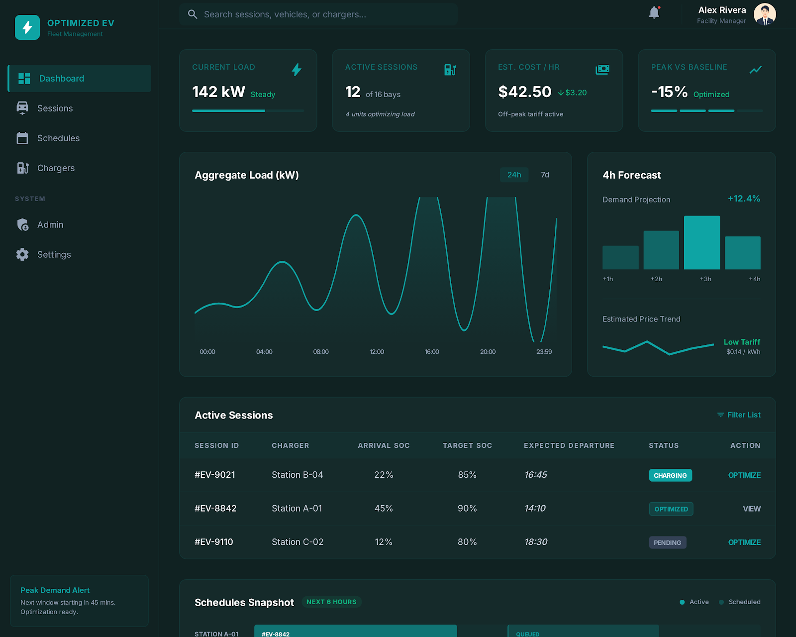
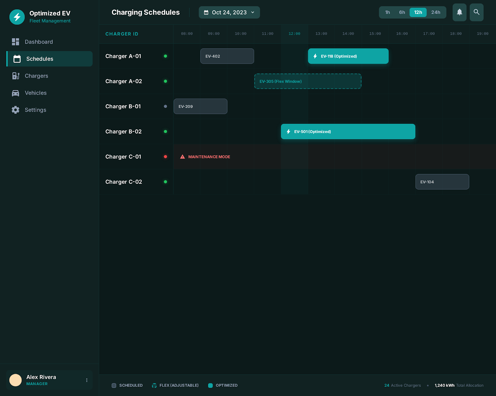
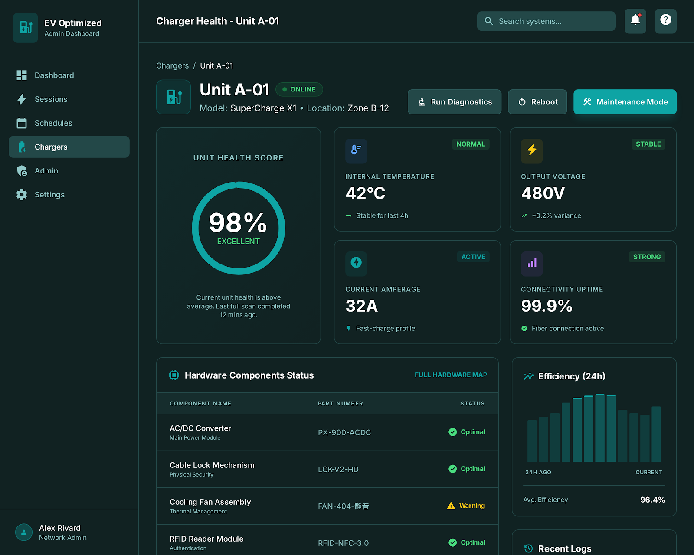
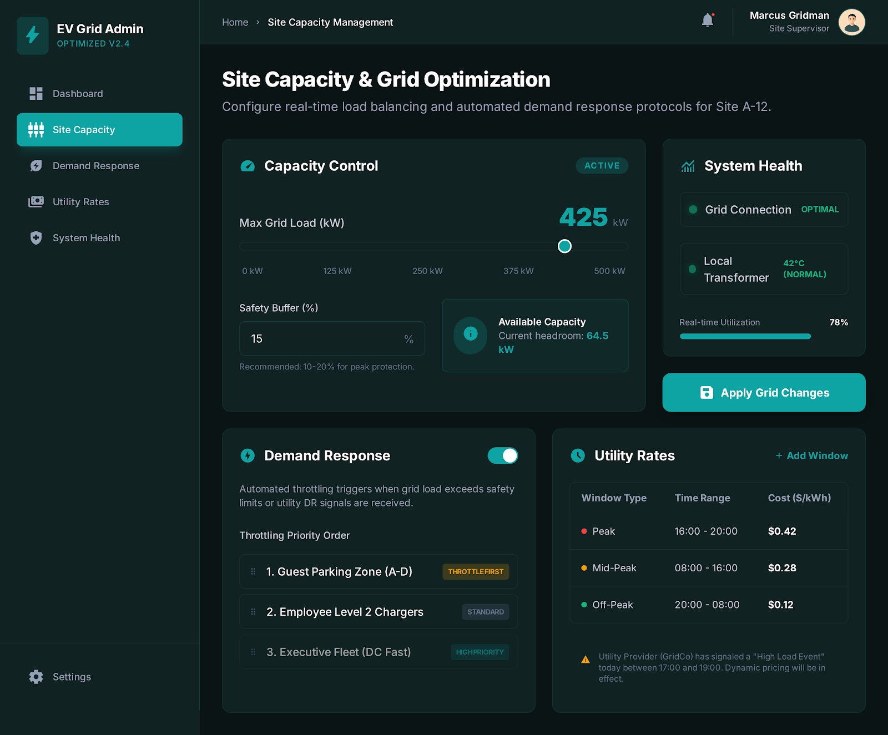

# ⚡ EV-ML-Project — EV Charging Admin System

A full-stack **Electric Vehicle Charging Administration System** with AI-powered demand forecasting, smart charge scheduling, and real-time monitoring. Built with a **FastAPI** backend and **React + Vite** frontend.

---

## 🚀 Features

- 📊 **Main Dashboard** — Real-time overview of charging sessions, grid load, and revenue
- 🔌 **Charger Management** — Monitor charger health, handle maintenance mode
- 📅 **Smart Scheduling** — Gantt-view charge scheduling with ML-based optimization
- 🔋 **Session Tracking** — Detailed EV session logs and analytics
- 🛡️ **Admin Panel** — Grid capacity control and system configuration
- 🤖 **ML Forecasting** — Demand forecasting using time-series models
- ⚙️ **Optimization Engine** — Linear programming-based charge scheduling

---

## 🏗️ Tech Stack

| Layer | Technology |
|-------|-----------|
| **Frontend** | React 18, Vite, React Router, CSS |
| **Backend** | Python, FastAPI, Uvicorn |
| **ML / Optimization** | Scikit-learn, SciPy (Linear Programming) |
| **Simulation** | Custom EV session simulator |

---

## 📁 Project Structure

```
EV-ML-Project/
├── backend/
│   └── app/
│       ├── main.py                  # FastAPI entry point
│       ├── simulator.py             # EV session simulator
│       ├── test_pipeline.py         # End-to-end test pipeline
│       ├── api/                     # API route handlers
│       └── services/
│           ├── forecast_service.py  # ML demand forecasting
│           └── optimization.py      # Charge scheduling optimizer
├── frontend/
│   └── src/
│       ├── App.jsx                  # Root component + routing
│       ├── main.jsx                 # Entry point
│       ├── api/                     # API client functions
│       ├── components/              # Shared components (Header, Sidebar)
│       ├── layouts/                 # Main layout wrapper
│       └── pages/
│           ├── dashboard/           # Main Dashboard
│           ├── chargers/            # Charger Health Detail
│           ├── schedules/           # Gantt Schedule View
│           ├── sessions/            # Session Detail View
│           └── admin/               # Admin Panel
└── .gitignore
```

---

## ⚙️ Getting Started

### Prerequisites
- Python 3.9+
- Node.js 18+
- npm

---

### 🔧 Backend Setup

```bash
# Navigate to backend
cd backend/app

# Create virtual environment
python -m venv .venv
.venv\Scripts\activate        # Windows
# source .venv/bin/activate   # macOS/Linux

# Install dependencies
pip install fastapi uvicorn scikit-learn scipy numpy

# Run the server
uvicorn main:app --reload
```

Backend runs at: `http://localhost:8000`  
API docs at: `http://localhost:8000/docs`

---

### 🎨 Frontend Setup

```bash
# Navigate to frontend
cd frontend

# Install dependencies
npm install

# Start dev server
npm run dev
```

Frontend runs at: `http://localhost:5173`

---

## 📸 Screenshots

| Main Dashboard | Gantt Schedule |
|---|---|
|  |  |

| Charger Health | Admin Panel |
|---|---|
|  |  |

---

## 🧪 Running Tests

```bash
cd backend/app
python test_pipeline.py
```

---

## 👤 Author

**Anish Choudhary** — [@knight384](https://github.com/knight384)

---

## 📄 License

This project is for educational and portfolio purposes.
